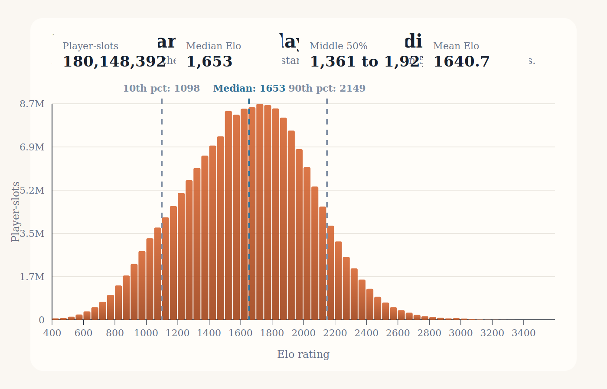
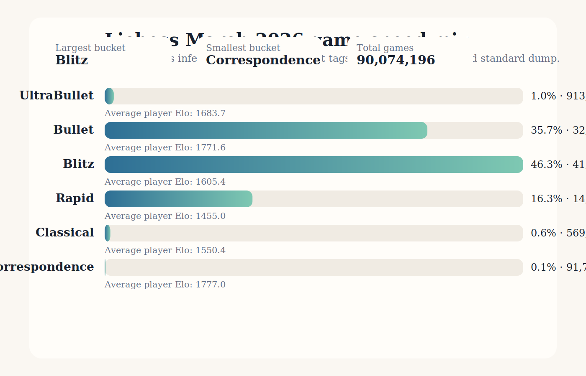

# Lichess March 2026 Analysis

This repo analyzes the official Lichess March 2026 rated standard dump:

- Source archive: [lichess_db_standard_rated_2026-03.pgn.zst](https://database.lichess.org/standard/lichess_db_standard_rated_2026-03.pgn.zst)
- Source index: [database.lichess.org/standard](https://database.lichess.org/standard/)
- Published archive size: `29,351,713,061` bytes

## What this repo produces

- `artifacts/march_2026_standard_summary.json`: aggregated counts and rating statistics
- `graphics/march_2026_player_elo_distribution.svg`: player-rating histogram
- `graphics/march_2026_game_speed_distribution.svg`: speed-class distribution
- `data/rapid_2026-03_sample_1500000/`: a uniform sample of 1.5M reduced-field rapid games, stored as split `.pgn.zst` chunks

## Method

`scripts/analyze_standard_dump.py` streams the decompressed PGN and extracts:

- `Event` for the game speed bucket
- `WhiteElo`
- `BlackElo`
- `TimeControl` as a fallback classifier if an event tag is unusual

The repo counts every game in the March 2026 `standard` dump and counts both player ratings for the Elo spread.
The checked-in runner filters the stream down to those four tags before Python sees it, which keeps the full-month parse practical without storing raw PGN in the repo.

## Reproduce

```bash
./scripts/run_march_2026_standard_analysis.sh
```

If you already have the March 2026 archive on disk, pass the local `.zst` path instead:

```bash
./scripts/run_march_2026_standard_analysis.sh /tmp/lichess_db_standard_rated_2026-03.pgn.zst
```

## Findings

March 2026 contains `90,074,196` rated standard games and `180,148,392` player-slots.

- The player-rating distribution centers in the mid-1600s: median `1653`, mean `1640.7`.
- The middle 50% of player-slots sit between `1361` and `1921` Elo, and the 10th to 90th percentile range is `1098` to `2149`.
- The pool is dense in the middle: `45.38%` of player-slots are between `1500` and `1999`, while only `1.48%` are `2500+`.
- Fast chess dominates the month: Blitz alone is `46.25%` of games, Bullet is `35.66%`, and together they make up `81.91%` of all rated standard games in the dump.
- Rapid still matters at `16.34%`, but Classical (`0.63%`) and Correspondence (`0.10%`) are tiny by comparison.
- The average player Elo is highest in Correspondence (`1777.0`) and Bullet (`1771.6`) and lowest in Rapid (`1455.0`). These are game-weighted player-slot averages, not unique-user averages.





### Speed Mix

| Speed | Games | Share | Avg player Elo |
| --- | ---: | ---: | ---: |
| UltraBullet | 913,807 | 1.02% | 1,683.7 |
| Bullet | 32,122,739 | 35.66% | 1,771.6 |
| Blitz | 41,661,445 | 46.25% | 1,605.4 |
| Rapid | 14,715,059 | 16.34% | 1,455.0 |
| Classical | 569,382 | 0.63% | 1,550.4 |
| Correspondence | 91,764 | 0.10% | 1,777.0 |
