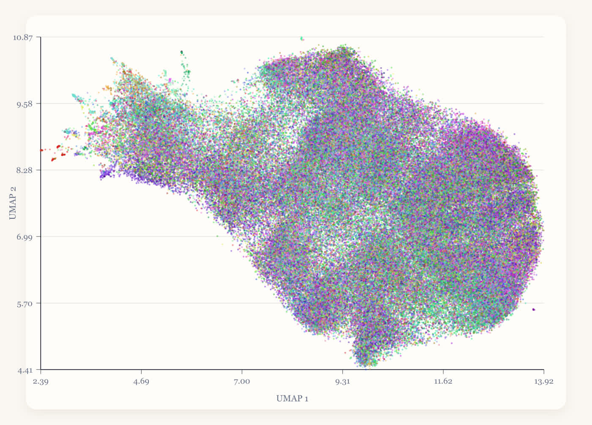

# Introduction

This project asks a simple question: can we estimate player strength from the chess positions that arise in real games? Our current work is aimed at building a clean baseline for that question rather than claiming a finished predictor. The emphasis so far is on three things: assembling a large rapid-game dataset, defining a position metric that is cheap to compute, and checking whether that metric produces meaningful structure when positions are visualized.

The data comes from the March 2026 Lichess rated standard dump. That month contains `90,074,196` rated standard games, including `14,715,059` rapid games. From the rapid pool we built a uniform sample of `1,500,000` games after excluding raw `Abandoned` and `Rules infraction` outcomes. Rapid is a reasonable first target because it is large, strategically richer than bullet, and closer to the kind of positions where rating-related decision quality may show up clearly.

# What We Hope To Accomplish

The near-term goal is to test whether board state alone contains enough signal to predict Elo, either as an exact value, an average player rating, or a coarse rating band. Before training a serious model, we need to answer two smaller questions:

- Do similar positions land near one another under our encoding?
- Do real sampled game positions show enough structure to justify supervised learning on top of that encoding?

If the answer is yes, the next step is a baseline predictor and a held-out evaluation. If the answer is no, then the representation needs to become more chess-aware before modeling effort is justified.

# Methodology

Our current method is intentionally simple. Each board is encoded as a length-64 vector ordered from `a8` to `h1`. Empty squares receive `0`. White `P, N, B, R, Q, K` receive codes `1` through `6`, and black `p, n, b, r, q, k` receive `7` through `12`. This preserves piece identity, color, and location, but ignores side to move, castling rights, en passant state, and move counters.

The distance between two positions is the number of squares whose encoded values differ. In normalized form, this is a Hamming-style distance over the 64 board entries:

$$
h(x, y) = \frac{1}{64} \sum_{i=1}^{64} [x_i \neq y_i].
$$

This gives us a fast, symmetric baseline that works well with vectorized computation and large corpora. We then replay sampled rapid games to ply `40`, or to the final position if a game ends earlier, and pair each recorded board with the game ratings. The current exploratory visualization uses UMAP with Hamming distance to project those high-dimensional board vectors into two dimensions.

The main limitation of this method is also the point of the baseline: it sees only placement. Two boards with identical piece placement but different castling rights or side to move are treated as identical. That is too coarse for a mature chess model, but useful as a first benchmark because it is transparent and easy to scale.

# Preliminary Graph And Legend

Our current preliminary graph is a UMAP of sampled rapid-game positions at ply `40`. The present artifact uses the first `150,000` sampled games. Of those, `113,217` reach the full `40` plies and `36,783` end earlier, so their final positions are used instead. The embedding uses Hamming distance with `n_neighbors = 30`, `min_dist = 0.10`, and random seed `20260406`.

Legend: each point is one sampled rapid position; color denotes opening family, and shade variation within that family. This is not yet an Elo plot. Its purpose is to test whether the current representation organizes real positions into a coherent geometric space before prediction is attempted.

{ width=92% }

# Contrast With Ganguly, Leveling, and Jones (2014)

Ganguly, Leveling, and Jones (2014) study a related problem: retrieving archived chess positions that are similar to a query position. Their paper is useful because it shows where a minimal position encoding starts to fail. A simple version of their representation, based on piece-color-square terms, is conceptually close to our baseline. The difference is that their best method adds chess structure beyond current piece locations: reachable squares, attack relations, defense relations, and ray attacks. Those features are then ranked with BM25 in an information-retrieval system.

That makes their similarity function richer than ours, but also different in kind. Our method is a direct symmetric distance between two board vectors. Their best system is a corpus-dependent retrieval score that uses context around each piece rather than only exact placement. In their evaluation, the richer combined feature set clearly outperforms true-position-only retrieval, which is strong evidence that contextual structure matters for approximate chess similarity.

For this project, that paper is less a replacement than a roadmap. Our current placement-only metric is the right baseline because it is fast and easy to evaluate. If it stops improving, the most principled next upgrade is to add Ganguly-style reachability and piece-connectivity features on top of the existing board encoding.

# Next Steps

The next milestone is to turn the current representation into a real supervised baseline. That means selecting one prediction target, training a simple model on the rapid corpus, and reporting held-out error honestly. The first comparisons should be simple: nearest neighbors on position distance, a basic regression model, and a small tree-based model against rating or rating bands.

After that baseline exists, richer features can be added in a controlled way. The most likely additions are side to move, castling rights, material summaries, and the reachability and attack/defense features suggested by Ganguly, Leveling, and Jones. The important point is to add them one at a time and measure what each one buys.

# Sources

- [Lichess standard database index](https://database.lichess.org/standard/)
- [March 2026 rated standard dump](https://database.lichess.org/standard/lichess_db_standard_rated_2026-03.pgn.zst)
- [McInnes, Healy, and Melville, *UMAP: Uniform Manifold Approximation and Projection for Dimension Reduction*](https://arxiv.org/abs/1802.03426)
- [`python-chess` documentation](https://python-chess.readthedocs.io/en/latest/)
- [Ganguly, Leveling, and Jones, *Retrieval of Similar Chess Positions*](https://doras.dcu.ie/20378/1/ganguly-sigir2014.pdf)
