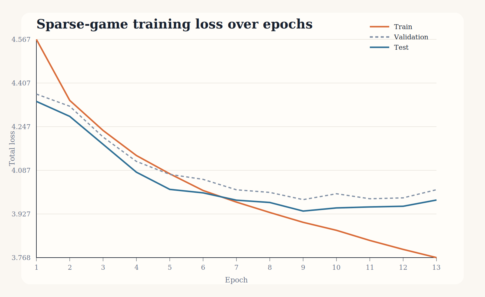
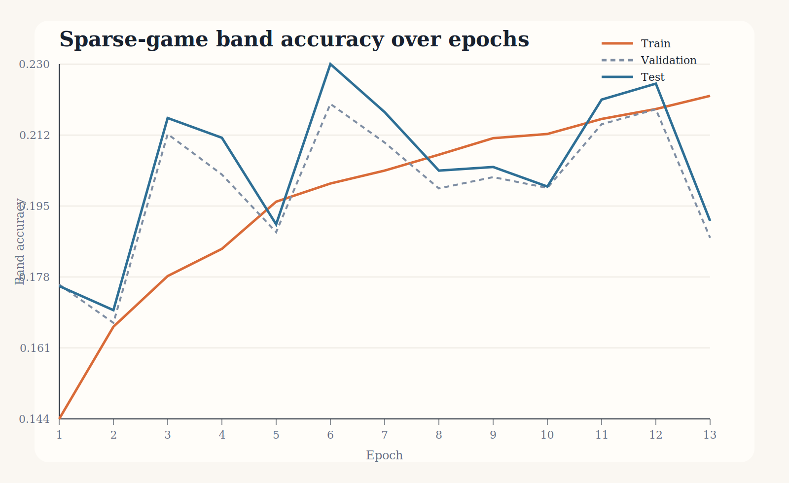

# Summary

This run trained on a uniform `200,000`-game subset of the March 2026 rapid sample using sparse board snapshots every `7` plies with the final position appended once when needed.
The model predicts both White and Black `200`-point rating bands while also learning auxiliary exact-Elo regression targets. The shared GRU state is the exported `128`-dimensional game embedding.

## Data And Model

- Source subset size: `200,000` games
- Train/val/test split: `159,999` / `19,998` / `20,003` games
- Total snapshots: `2,127,383`
- Max snapshots per game: `80`
- Rating bands: `<400, 400-599, 600-799, 800-999, 1000-1199, 1200-1399, 1400-1599, 1600-1799, 1800-1999, 2000-2199, 2200-2399, 2400-2599, 2600-2799, 2800-2999, 3000-3199, >=3200`
- Optimizer: `AdamW(lr=0.001, weight_decay=0.0001)`
- Early stopping patience: `4` epochs

## Training Curves

## Final Held-Out Metrics

- Best validation epoch: `9`
- Test total loss at best epoch: `3.9381`
- Test band accuracy at best epoch: `20.47%`
- Test exact-Elo MAE at best epoch: `225.04`
- Test exact-Elo RMSE at best epoch: `283.99`

## Embedding Usage

The trained checkpoint exposes `encode_games(batch)` through `SparseGameRatingBandModel`, returning one `128`-dimensional embedding per game. The `export_game_embeddings` command writes those embeddings to an `.npz` file alongside `game_index`, Elo labels, band ids, split labels, and copied metadata such as `site` and `opening`.
